# TinyServer运行

### 运行

- build

```
sh ./build.sh
```

- 启动server

```
./server
```

- 浏览器端

```
127.0.0.1:9006
```

效果如下：


### 配置环境

#### 安装mysql

依次输入以下命令：

```
sudo apt update
sudo apt install mysql-server
sudo mysql_secure_installation
```

设置的时候都按y即可，这样没有给root设置密码。

查看mysql：

```shell
systemctl status mysql.service
```

如图：

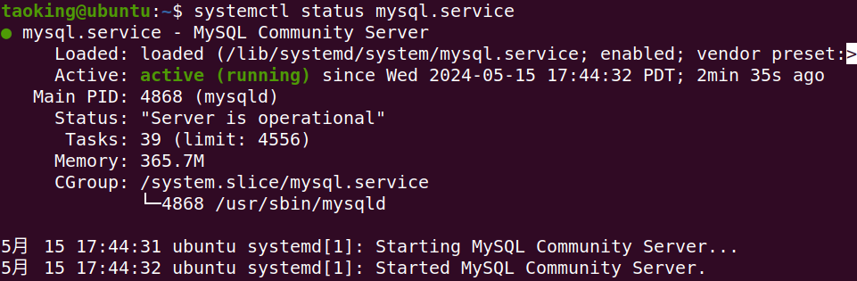

运行mysql：

```
sudo mysql -u root -p
```

由于没有设置密码，输入密码直接按回车即可。

结果如下：

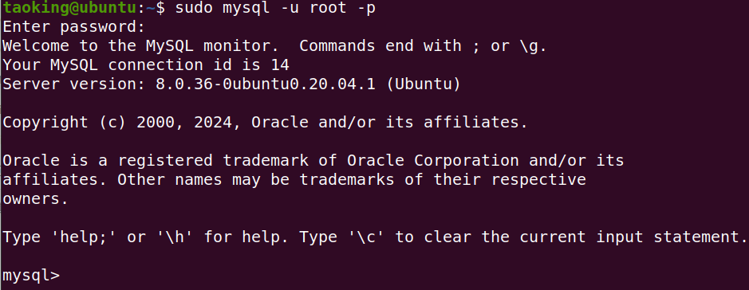

安装成功，接下来配置mysql的数据。

#### 配置mysql

创建数据库并插入数据

```mysql
// 建立yourdb库
create database mydata;

// 创建user表
USE mydata;
CREATE TABLE user(
    username char(50) NULL,
    passwd char(50) NULL
)ENGINE=InnoDB;

// 添加数据
INSERT INTO user(username, passwd) VALUES('TaoKing', '123');
```

修改main.cpp中的数据库初始化信息


### 报错处理

#### mysql安装

make后，报错：

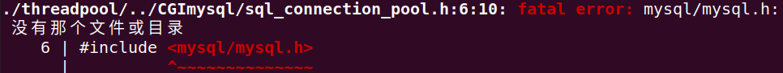

意思是没有安装MySQL，安装：

```
sudo apt-get install libmysqlclient-dev
```

####  MySQL Error

运行./server后，没有反应，查看日志


输入，不用输入密码，按回车就行

```
sudo mysql -u root -p
```

进入mysql中，运行下面代码：

```mysql
ALTER USER 'root'@'localhost' IDENTIFIED WITH mysql_native_password BY '12345678';
```

修改密码，方便代码登录。

回头发现，之前的代码填错了，修改：


问题解决

https://github.com/wzt-916/MyTinyWebServer/commit/f2a09e9ba3be7fab03665e71250612827dc2275b)


# 基础

## TCP连接状态

## 服务器-客户端连接通信

## 端口复用

**端口复用**（Port Reuse）是指允许多个套接字在同一个端口上绑定，通常用于提高服务器的并发性能。实现端口复用的关键在于设置套接字选项`SO_REUSEADDR`或`SO_REUSEPORT`。这可以通过`setsockopt`函数来完成。

端口复用最常用的用途是防止服务器重启时之前绑定的端口还未释放或者程序突然退出而系统没有释放端口。这种情况下如果设定了端口复用，则新启动的服务器进程可以直接绑定端口。如果没有设定端口复用，绑定会失败。

可用setsockopt实现。

```c++
#include <sys/types.h>
#include <sys/socket.h>

int setsockopt(int sockfd, int level, int optname, const void *optval, socklen_t optlen);
```

## 多路转接I/O – epoll模型

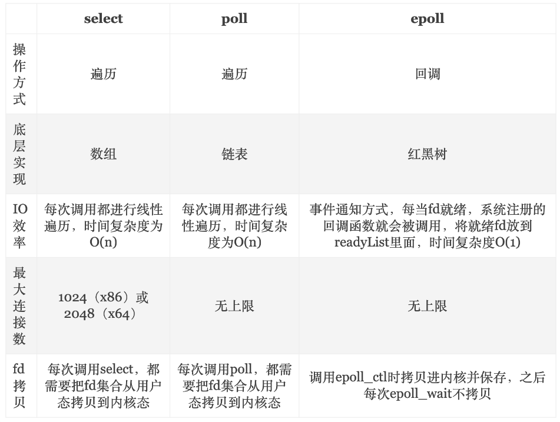

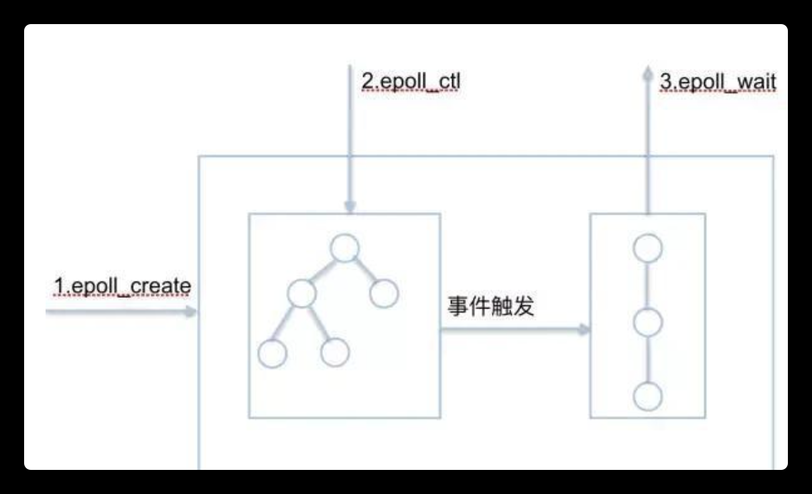

`epoll` 是 Linux 提供的一种高效的 I/O 事件通知机制，它相对于传统的 `select` 和 `poll` 系统调用具有更高的性能和可扩展性，特别适用于需要处理大量并发连接的网络服务器应用。

### `epoll` 的主要特性

1. **高效的事件通知机制**：
   - `epoll` 使用基于事件驱动的模型，而不是轮询模型，因此在处理大量文件描述符时效率更高。
   - 内核在事件发生时主动通知用户空间应用程序，而不是应用程序主动查询事件状态。
2. **支持水平触发（LT）和边缘触发（ET）**：
   - 水平触发（Level Triggered, LT）：默认模式，只要文件描述符上有事件没有处理，就会不断通知应用程序。
   - 边缘触发（Edge Triggered, ET）：高效模式，仅当文件描述符的状态发生变化时通知应用程序，更适合处理高并发连接。
3. **常量时间复杂度**：
   - 在添加、删除和修改监听的文件描述符时，`epoll` 操作的时间复杂度是 O(1)，而 `select` 和 `poll` 的时间复杂度是 O(n)。


## Reactor模式


## http协议

### HTTP工作原理

HTTP协议定义Web客户端如何从Web服务器请求Web页面，以及服务器如何把Web页面传送给客户端。HTTP协议采用了请求/响应模型。客户端向服务器发送一个请求报文，请求报文包含请求的方法、URL、协议版本、请求头部和请求数据。服务器以一个状态行作为响应，响应的内容包括协议的版本、成功或者错误代码、服务器信息、响应头部和响应数据。

以下是 HTTP 请求/响应的步骤：

1. 客户端连接到Web服务器
   一个HTTP客户端，通常是浏览器，与Web服务器的HTTP端口（默认为80）建立一个TCP套接字连接。例如，http://www.luffycity.com。
2. 发送HTTP请求
   通过TCP套接字，客户端向Web服务器发送一个文本的请求报文，一个请求报文由请求行、请求头部、空行和请求数据4部分组成。
3. 服务器接受请求并返回HTTP响应
   Web服务器解析请求，定位请求资源。服务器将资源复本写到TCP套接字，由客户端读取。一个响应由状态行、响应头部、空行和响应数据4部分组成。
4. 释放连接TCP连接
   若connection 模式为close，则服务器主动关闭TCP连接，客户端被动关闭连接，释放TCP连接;若connection 模式为keepalive，则该连接会保持一段时间，在该时间内可以继续接收请求;
5. 客户端浏览器解析HTML内容
   客户端浏览器首先解析状态行，查看表明请求是否成功的状态代码。然后解析每一个响应头，响应头告知以下为若干字节的HTML文档和文档的字符集。客户端浏览器读取响应数据HTML，根据HTML的语法对其进行格式化，并在浏览器窗口中显示。

### HTTP请求方法

<code>GET</code>

向指定的资源发出“显示”请求。使用GET方法应该只用在读取数据，而不应当被用于产生“副作用”的操作中，例如在Web Application中。其中一个原因是GET可能会被网络蜘蛛等随意访问。

<code>POST</code>

向指定资源提交数据，请求服务器进行处理（例如提交表单或者上传文件）。数据被包含在请求本文中。这个请求可能会创建新的资源或修改现有资源，或二者皆有。

### HTTP状态码

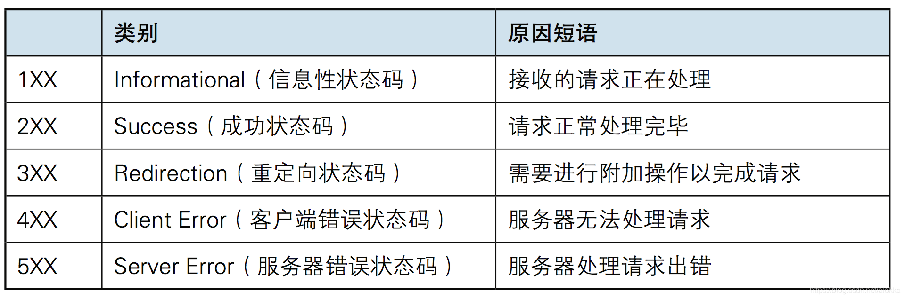

### HTTP请求格式(请求协议)

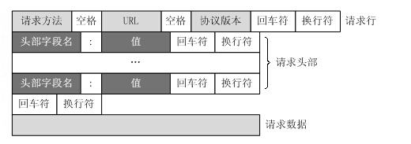

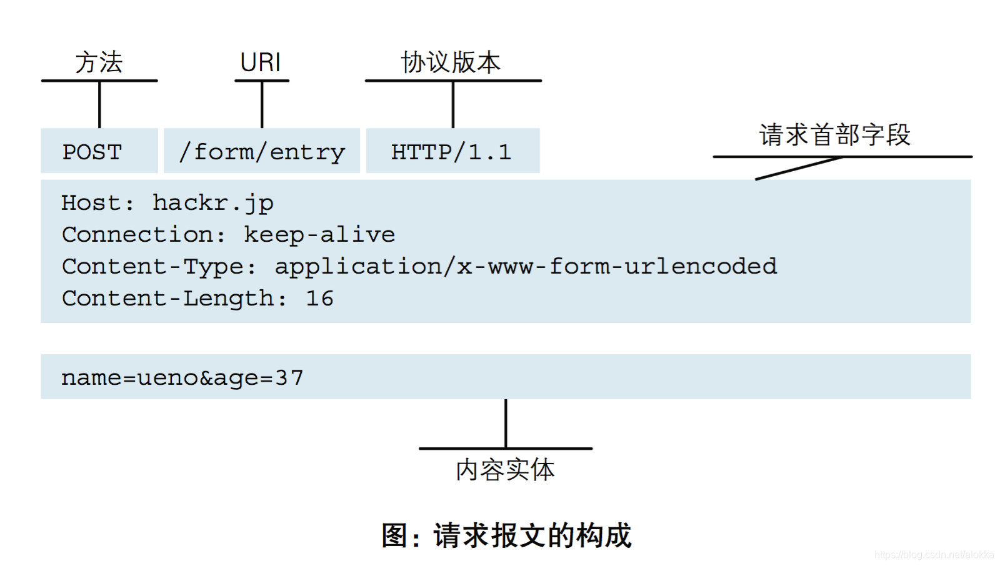

### HTTP响应格式（响应协议）


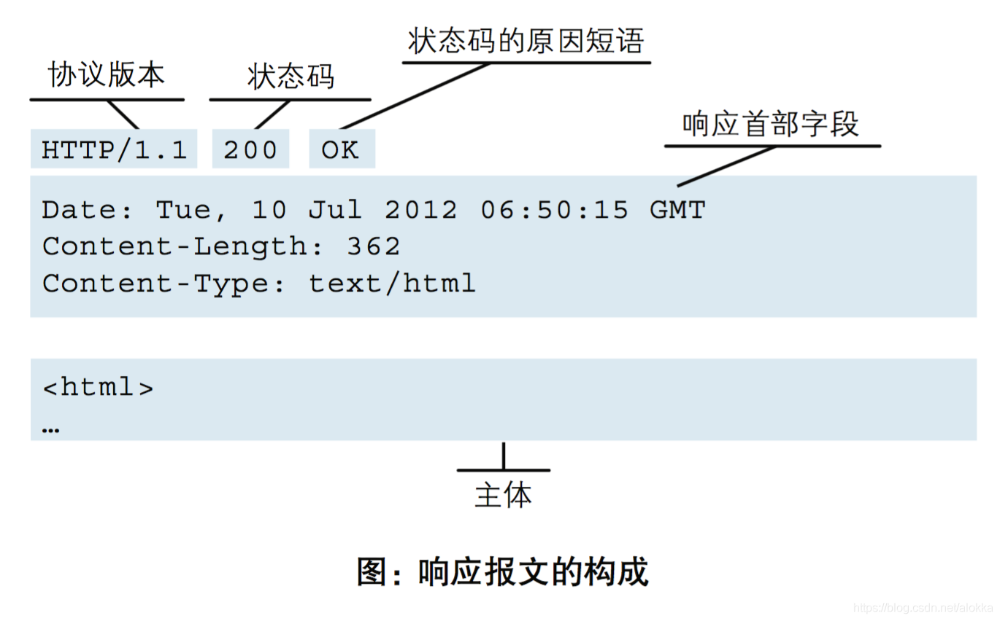

# 项目历程记录

## 框架

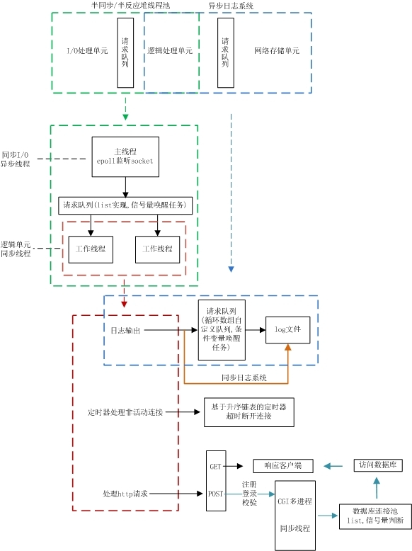

## 代码进度

### 项目初始化 and 参数测试

在myTinyWebServer文件夹中创建main.cpp和webserver.cpp,后续主要服务器代码放在webserver.cpp中，方便管理代码，同时将创立头文件

#### 运行

```
./server -p 8080
```

#### 目录结构

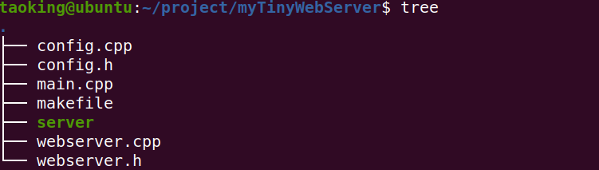

### epoll+ET+非阻塞IO实现简易服务器

为了实现一个简易服务器，通过 `epoll` 的边缘触发（ET）模式和非阻塞 I/O 来处理大量并发连接，实现服务器与客户端的应答通信。具体包括以下步骤：

1. **使用 `epoll` 进行 I/O 多路复用**：
   - `epoll` 可以高效地处理大量文件描述符，并且在高并发场景下表现优异。
   - `epoll` 的 ET 模式减少了不必要的系统调用，提高了事件处理效率。
2. **端口复用**：
   - 通过设置 `SO_REUSEADDR` 和 `SO_REUSEPORT`，实现端口复用，允许多个进程或线程绑定同一个端口，提高并发处理能力。
3. **非阻塞 I/O**：
   - 在 ET 模式下，必须使用非阻塞 I/O，以确保在数据没有完全读取或写入时，避免阻塞其他连接的处理。
   - 非阻塞 I/O 可以减少系统调用次数，提高整体处理效率。

#### 运行

开启服务器：

```
./server -p 8080
```


客户端进行连接：

```
nc 127.0.0.1 8080
```

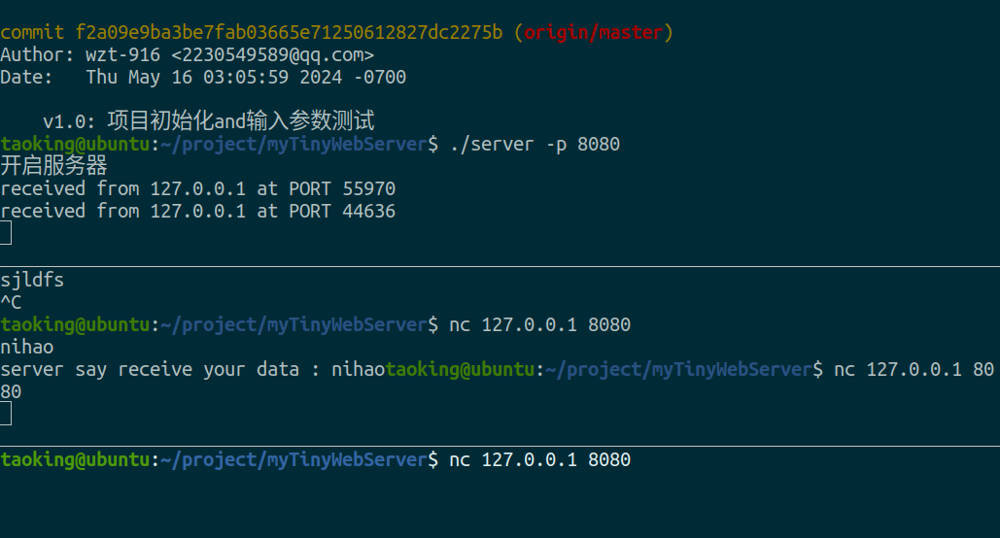

同时连接了两个客户端，实现了并发连接。

输入数据，进行通信：

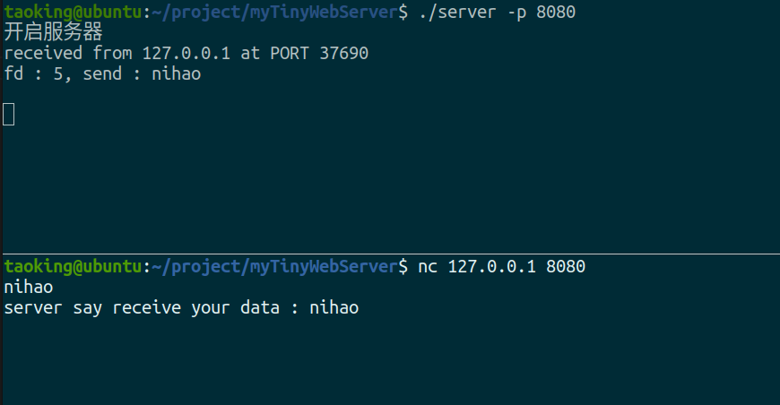

#### 目录结构

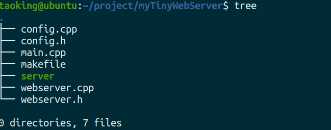

### 设置定时器

> 定时器处理非活动连接

由于非活跃连接占用了连接资源，严重影响服务器的性能，通过实现一个服务器定时器，处理这种非活跃连接，释放连接资源。利用alarm函数周期性地触发SIGALRM信号,该信号的信号处理函数利用管道通知主循环执行定时器链表上的定时任务.
* 统一事件源
* 基于升序链表的定时器
* 处理非活动连接

#### 流程图

先定义捕抓信号的函数

```c++
//参数一是信号，参数二是处理函数
utils.addsig(SIGPIPE, SIG_IGN);
utils.addsig(SIGALRM, utils.sig_handler);
utils.addsig(SIGTERM, utils.sig_handler);
```

详细流程图如下：

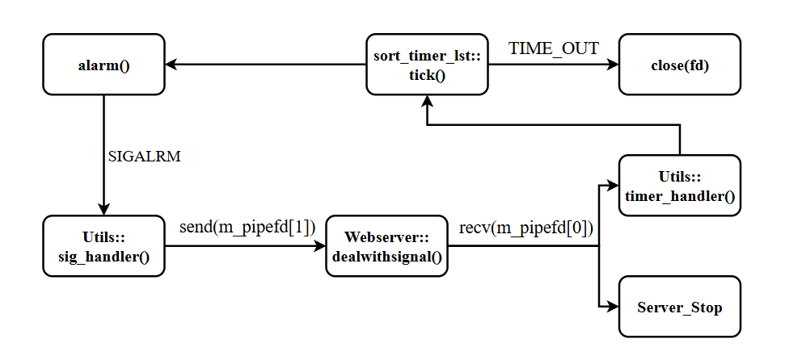

#### 运行

开启服务器：

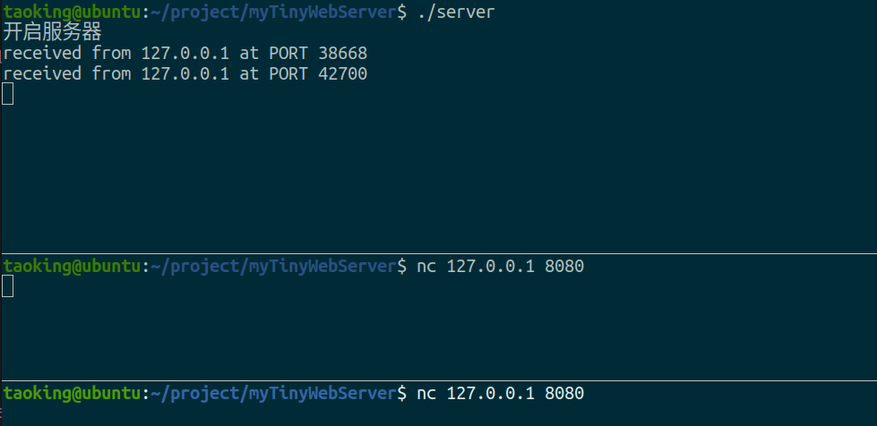

等到5s过后，超时，主动释放连接，关闭套接字:

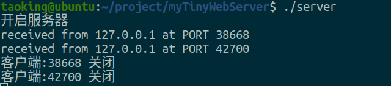

### 半同步/半反应堆线程池

使用一个工作队列完全解除了主线程和工作线程的耦合关系：主线程往工作队列中插入任务，工作线程通过竞争来取得任务并执行它。

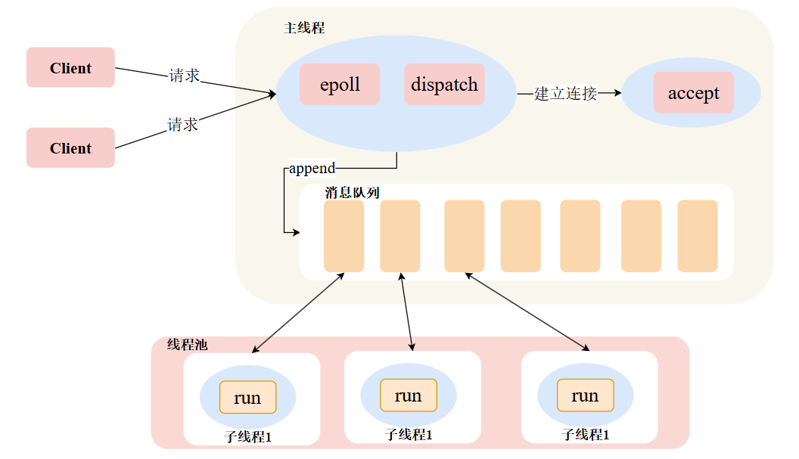 **Reactor事件处理模式:**

- 主线程充当异步线程，负责监听所有socket上的事件；

- 若由新的请求到来，则主线程接受它并得到新的连接socket，然后往epoll内核时间表中注册该socket上的读写事件；
- 若是已连接的socket上有读写事件发生，主线程将该socket放入共享的请求队列中；
- 所有工作线程睡眠在请求队列上，当有任务到来时，通过竞争获得任务；

#### 运行


## git

[v1.0: 项目初始化and输入参数测试](https://github.com/wzt-916/MyTinyWebServer/commit/f2a09e9ba3be7fab03665e71250612827dc2275b)


# 测试

## 开发过程测试

### 探究ET模式下为什么一定要用非阻塞I/O

#### ET+阻塞I/O

在使用 `epoll` 的边缘触发（ET）模式时，需要将套接字设置为非阻塞模式，原因是在 ET 模式下，内核只会通知一次事件，因此需要尽可能多地处理该事件，直到没有数据可读。如果套接字是阻塞的，可能会导致服务器在处理一个客户端连接时阻塞在 `recv` 函数，从而无法处理其他客户端的连接请求。这也是为什么必须使用非阻塞 I/O 的原因。

```c++
//MSG_WAITALL：等待所有请求的数据到达后再返回。
int len = recv(sockfd, buf, sizeof(buf), MSG_WAITALL);
```

设置了参数后，等待读取**sizeof(buf)**长度的数据，否则将会阻塞等待客户端发送来数据，服务器将会阻塞在**recv**函数中，如果此时一个客户端请求连接，服务器因阻塞在recv函数中无法响应，无法返回epoll_wait响应连接请求。


如图，当第一客户端请求连接，服务器作出应答，建立连接请求，但当客户端发送数据却没有到达sizeof(buf)，服务器等待客户端继续发数据。这时又有一个客户端发送连接请求，由于服务器阻塞在recv函数中，无法跟客户端进行连接，此时不能并发处理连接请求。

#### ET+非阻塞I/O

将套接字设置为非阻塞I/O后，运行如下：


服务器接收客户端发送过来的数据，无论数据是多少都会立即返回，不会阻塞等待。

### 端口复用

下图为tcp连接状态图：

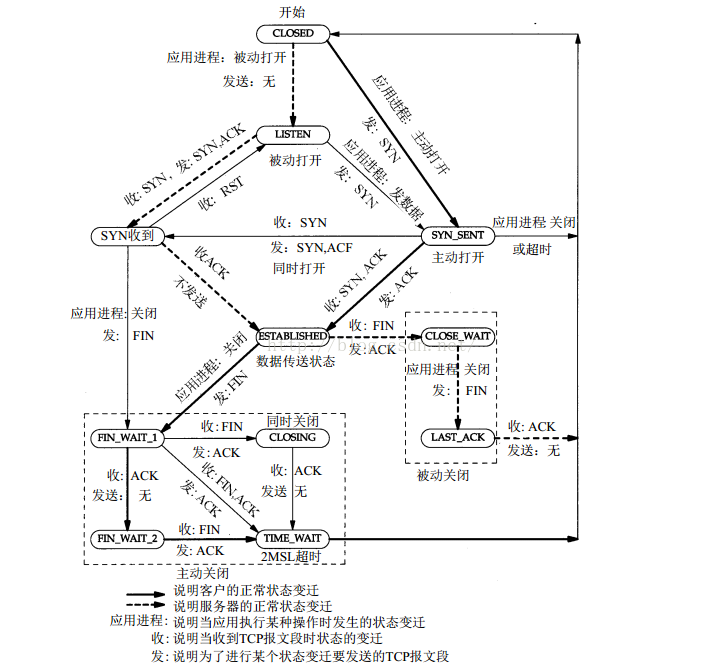

设置端口复用的目的主要有两个方面：

1. **快速重启服务器：** 端口复用允许一个套接字在关闭后立即重新绑定到相同的端口上。这对于快速重启服务器很有用，因为它允许新实例立即接管之前的端口，而无需等待一段时间，直到操作系统释放该端口。
2. **提高并发连接性能：** 在高并发情况下，如果服务器要监听的端口没有启用端口复用，那么在套接字关闭后，该端口将会处于 TIME_WAIT 状态一段时间（通常为几分钟）。在这段时间内，该端口将不能立即被新的套接字使用，导致新的连接请求无法及时处理。启用端口复用后，新的套接字可以立即绑定到相同的端口上，从而提高了并发连接性能。

#### 没有端口复用

在这种情况下，如果服务器在关闭后未启用端口复用，则服务器将处于 TCP 释放连接的 TIME_WAIT 状态。在这种状态下，服务器无法立即重新启动，因为需要等待端口的 TIME_WAIT 状态结束，才能再次建立连接。

打开服务器，打开客户端，查看连接状态

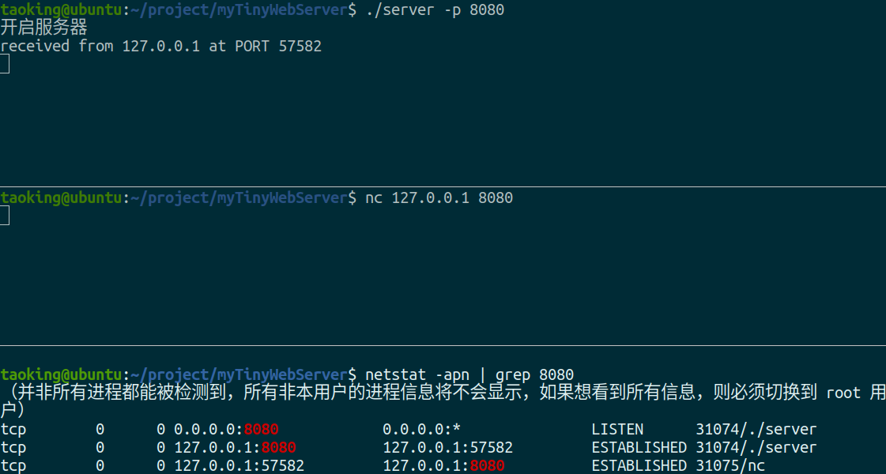

可以看出，现在服务器和客户端都是ESTABLISHED(数据传输状态)，当关闭服务器时，由于客户端没有关闭，服务器会到达FIN_WAIT_2状态，等待客户端关闭。

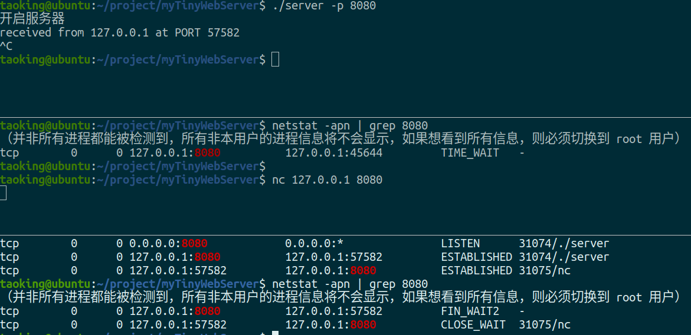

此时关闭客户端，服务器就会到达TIME_WAIT状态

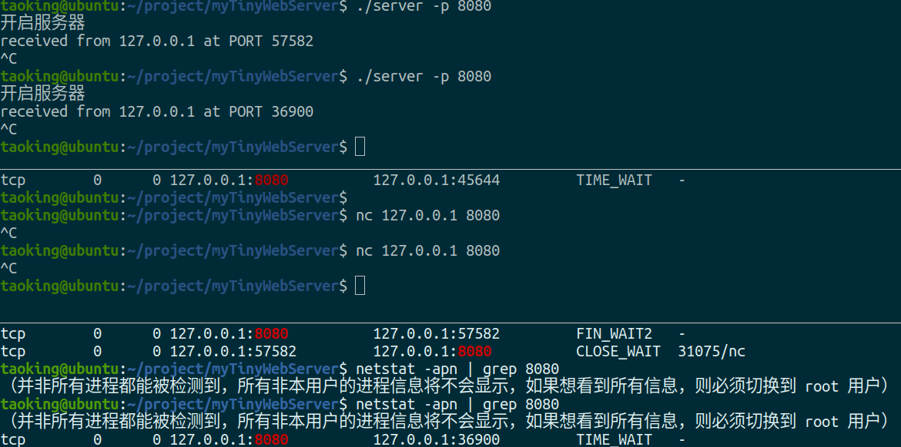

由于没有设置端口复用，而此时服务器在TIME_WAIT状态占用端口，再次打开服务器，发现无法打开，这是因为端口被占用。

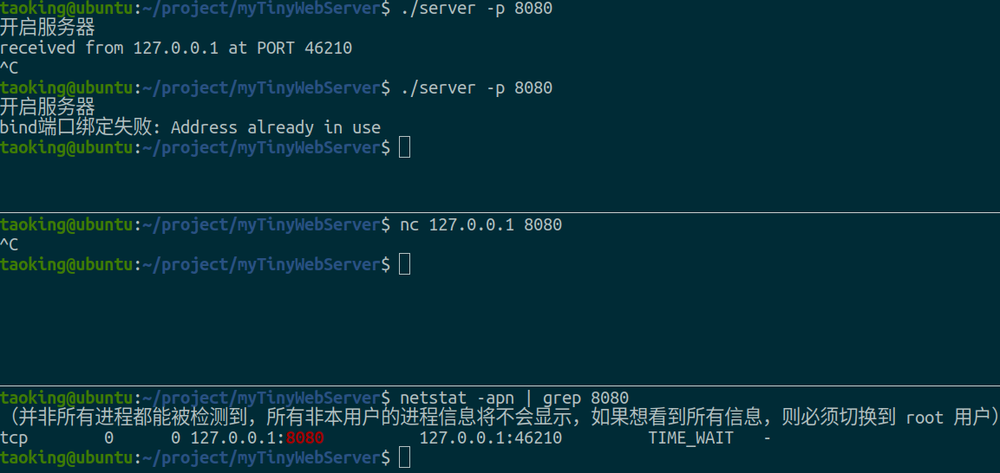

#### 有端口复用

就算上次关闭的服务器在TIME_WAIT状态，此时再次打开服务器依旧可以。

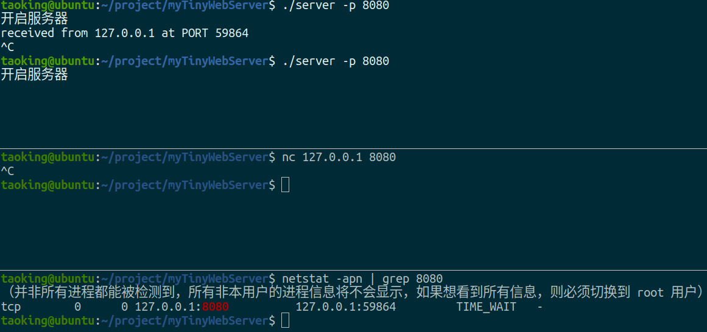

## 压力测试

# Linux基础命令


```shell
sudo strace -f ./server
```

查找与特定端口相关的网络连接和进程信息

```shell
netstat -apn | grep 8000
```


# 优化

## 定时器用双链表


# ERROR

## 模板类的实现必须在头文件中

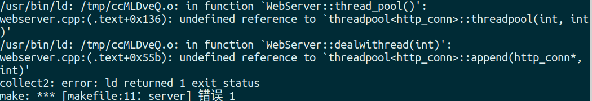

